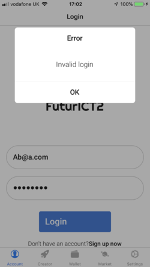
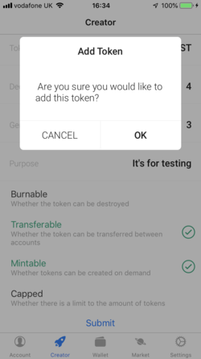
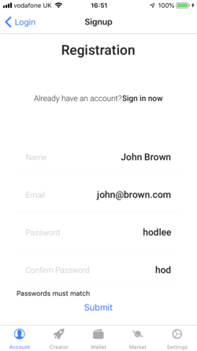
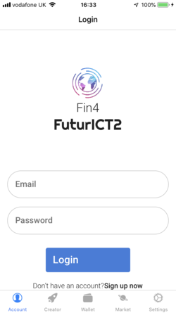
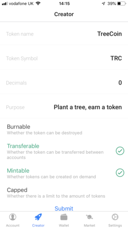
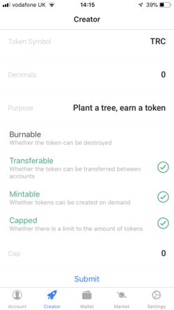
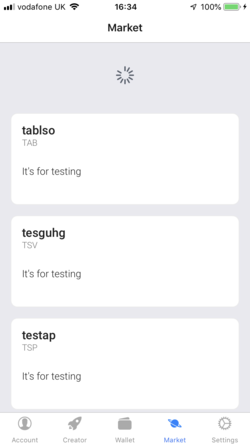
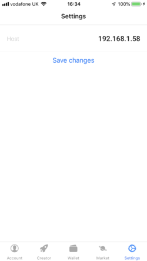
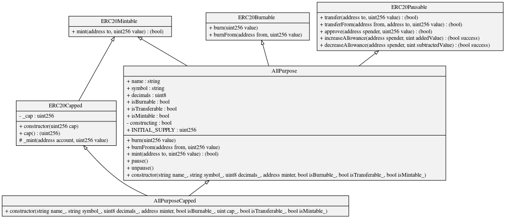

# Finance 4.0 Native Mobile App

This repository contains a front-end of the Finance 4.0 developed in React Native for Android and iOS devices.

It details the development of a software artefact which offers an easy interface for non-technical users to create tokens, using the framework, taxonomy and classification specified in Ballandies et. al [1].

# Introduction

 Many communities lack the resources to create tokens, which is why it was decided that an easy interface to create versatile tokens should be made, so a smartphone app has been developed for Android and iOS. 
 
 The user of the software artefact will be able to sign up and log into the Fin4 server and see their tokens, as well as other tokens on the server. The user will also be able to easily create a token through the server on the main Ethereum network. The user will be able to decide the name, decimals, symbol and purpose of the token, whether the token will be capped (and if so, the cap itself), as well as whether the token can be minted, burnt or transferred. 
 
 The application was developed with Expo, which allows the developer to easily test the application on many devices. The app can be downloaded from and the code can be audited on the following links respectively. Please note that communications with the server will not work unless the user has a working fin4 environment set up. More information on this in the "set up" section below.

https://expo.io/@gabh/TokenCreator

https://github.com/higab85/token-creator 

# Set up
To run the application on your device, you can either use the prebuilt version, or build it locally. Both need [Expo](https://expo.io/) installed on the device. APK's may be released in the future.

### Prebuilt instructions
Follow [this link](https://expo.io/@gabh/TokenCreator) to download the app from the device.

### Locally built
```
git clone https://github.com/higab85/tokencreator
cd tokencreator
npm install
expo start
```

## Server
There is a test server running Fin4-core at www.finfour.net.

If you would like to create your own server, please follow the documentationon [the fin4-core github page](https://github.com/FuturICT2/fin4-core).

The user can use any running server by pointing the [host in settings](#settings-view) to the desired IP or URL.

# How to use the app

## Modals
After implementing Redux, where state is saved globally, one can be left wondering what to do with the UI state. If certain actions only affect the current screen then surely one should only manipulate the state in that class. The best practice is to [handle the UI with redux](https://codeburst.io/how-to-manage-ui-state-with-redux-24deb6cf0d57).

By handling the UI state with redux, the application state, one can trigger UI changes between sibling components. It also enables one to, for example, trigger a modal (pop-up prompts) when the application has received an asynchronous response, and the user has already changed the view. When UI elements such as Modals can be triggered via actions, the modal need only be declared on one parent class. Two kinds of Modal were made: 
- **Confirmation**: This modal has two buttons, one to confirm the user actually wants to do something, and the other to cancel that and not do anything. This modal is triggered when the user wants to delete a token-wallet. The user is asked for their confirmation before the token is actually deleted. 
- **Information**: This modal has one button (OK) which doesn't do anything. These modals’ only function is to inform the user that something has (or has not) happened. This modal is used when there has been an error logging in or when something has happened in the application.

  

## Account Tab
On first opening the app, the user will be greeted with the a navigation bar with 5 tabs open on the Account tab. 

If the user is logged in, the Profile view will be shown, where they can see their information and log out from. 

If the user is not logged in, the Log in view will be shown, where the user can log into the server from. From this view, the user can access the Sign up view by tapping the “Sign up now” button. 

On the Sign up view, the user can sign up to the server. The password and confirm password must match.

Any errors will be relayed on a prompt.

   

## Creator View
Next to the Login View we have the Creator view where the user can create tokens on the Fin4 server. The user will be able to choose:
- Token name
- Token symbol
- Decimals
- Purpose
- Burnability
- Transferability
- Mintability
- Whether it is capped (and if so, the cap)

All fields must be filled in, except for the cap if the token is uncapped. The token symbol must be 3 letters, the decimals field only accepts integers between 0 and 255, and the cap accepts any integer greater or equal to 1.

| Field           | Type    | Input validation        |
|-----------------|---------|-------------------------|
| Name            | String  | None                    |
| Symbol          | String  | 3 Characters            |
| Decimals        | Integer | 0<x<255                 |
| Purpose         | String  | None                    |
| Burnability     | Boolean | None                    |
| Transferability | Boolean | None                    |
| Mintability     | Boolean | None                    |
| Capped          | Boolean | None                    |
| Cap             | Integer | if Capped is true: x>0  |

Once the user taps submit, A prompt will appear confirming the user wants to create the token. The user will be able to carry out the action by tapping OK, or abort the action by tapping cancel.

  

## Wallet view
This view shows the tokens held by the user, and the balance. This view can be refreshed by pulling down the screen.


## Market view
This view shows the tokens available on the Fin4 server. This view can be refeshed by pulling down the screen.



## Settings view
The user can specify the URL or IP of the Fin4 server on this view.



# Main technologies used in the app
- The app was developed in React Native.
- Expo simplified the simulation on iOS, and deployment.
- Redux was used for state management.
- React Native Router Flux was used for navigation.
- Formik was used for the forms.
- React Native UI Kittens was used for the user interface.

# Adding functionality to the app
Integrating a new field to the form is extremely easy:
1. In `app/containers/Creator.js`, add the name of the variable and give it a default value (under `initialValue` on line 52), and the necessary validation (under `validationSchema` on line 67) in the `Formik` component.
```jsx
// app/containers/Creator.js
// [...]
// LINE 46
<KeyboardAvoidingView style={styles.root} 
  behavior="padding" enabled>
  <ScrollView >
    <Formik
      style={styles.form}
      initialValues={{
        name: 'TreeCoin',
        symbol: 'TRC',
        decimals: '0',
        purpose:'Plant a tree, earn a token',
        isBurnable: false,
        isTransferable: true,
        isMintable: true,
        isCapped: false,
        cap: '0'
        // [EXAMPLE] ADD FIELD HERE
        // EG. INITIAL SUPPLY
        ,initialSupply: '100'
        // Note that if it's a number, it will have to be in string format
      }}
      // name: '',
      //   symbol: '',
      // }}
      onSubmit={(values, actions) => this.props.confirmAddToken(values)}
      validationSchema={Yup.object().shape({
        name: Yup.string()
          .required(),
        symbol: Yup.string()
          .min(3)
          .max(3)
          .required(),
        decimals: Yup.number()
          .min(0)
          .max(255)
          .required(),
        purpose: Yup.string()
          .required(),
        isBurnable: Yup.boolean()
          .required(),
        isTransferable: Yup.boolean()
          .required(),
        isMintable: Yup.boolean()
          .required(),
        isCapped: Yup.boolean()
          .required(),
        cap: Yup.number()
          .when("isCapped", {
            is: true,
            then: Yup.number().min(1).required()
        // [EXAMPLE] FOLLOWING THE INITIAL SUPPLY EXAMPLE
        ,initialSupply: Yup.number()
          .min(0) // negative initial supplies don't work...
          .required() // if it isn't required, then not. 
                      // see "cap" above for an interesting case
          })
      })}
// [...]
    />
  </ScrollView>
</KeyboardAvoidingView>
```
2. Add the `Input` field inside the `React.Fragment` component (between lines 102 and 182), making sure you respect other `Input` fields.
```jsx
// app/containers/Creator.js
// [...]
// LINE 165
<Input
  label="Capped"
  value={values.isCapped}
  onChange={setFieldValue}
  onTouch={setFieldTouched}
  name="isCapped"
  description="Whether there is a limit to the amount of tokens"
  error={touched.isCapped && errors.isCapped}
/>
{ values.isCapped &&
  <Input
  label="Cap"
  value={values.cap}
  onChange={setFieldValue}
  onTouch={setFieldTouched}
  name="cap"
  error={touched.cap && errors.cap}
  />}
// [EXAMPLE] AGAIN, WE WILL ADD THE INITIAL SUPPLY USE CASE
<Input
  label="Initial supply"
  value={values.initialSupply}
  onChange={setFieldValue}
  onTouch={setFieldTouched}
  name="initialSupply"  // name of the input, used for IDing
  error={touched.initialSupply && errors.initialSupply} // this will hold whether the field has been touched yet, and if so AND there is a validation error, the error will jump
/>

<Button
backgroundColor="Blue"
style={styles.button}
onPress={handleSubmit}
// disabled={!isValid }
title="Submit"
loading={isSubmitting}
/>
// [...]
```
3. If the value is a non-integer value, then nothing else needs to be done. If it is an integer, this value must be parsed to a string in `app/actions/apiActions.js`, under `fetchCreateToken()` on line 195. This must be done after the `serverToken` declaration (line 196), and before the `return` function (line 202). Eg. We want to add a variable called `initialSupply`, we’d write `serverToken.initialSupply = parseInt(token.initialSupply)` on line 201 of `app/actions/apiActions.js`. The reason it must be parsed first is because the Fin4 server will return an error if numbers aren’t parsed as strings.
```js
// app/actions/apiActions.js
// [...]
// LINE 195
export function fetchCreateToken(token){
  let serverToken = {...token}
  if (!token.isCapped)
    serverToken.cap = 0
  serverToken.decimals = parseInt(token.decimals)
  serverToken.cap = parseInt(token.cap)
  // [EXAMPLE] INITIAL SUPPLY EXAMPLE 
  // SINCE INITIAL SUPPLY IS AN INTEGER, IT MUST BE PARSE
  serverToken.initialSupply = parseInt(token.initialSupply)

  return function(dispatch) {
    // dispatch(requestSignup())
    return fetch( 'http://' + getHost() + ':8181/wapi/ap-assets', {
        method: 'POST',
        headers: {
          Accept: 'application/json',
          'Content-Type': 'application/json',
        },
        credentials: 'same-origin',
        body: JSON.stringify(serverToken),
      })
      .then( response => handleResponse(response, dispatch, receiveCreateTokens) )
    }
}

```


# System archicture

The structure of the app follows the [Flux principles](https://github.com/facebook/flux/tree/master/examples/flux-concepts). Flux is a pattern for a managing data-flow in an application, where data only travels in one direction. For this application, Redux has been used. There are 4 parts in the flux system: view, action, dispatcher and the store.

## The store
The store is where the hierarchical data is held. This universal tree of data can be accessed from wherever in the application, and seeks to maintain consistent state throughout it. While this information can be accessed by any component, it must only be manipulated in response to an action. When the store changes, an event should be emitted to notify views connected to it, that they should update the information displayed (if applicable).

In this application, 2 ways of accessing the store have been used; 
1. Directly on the actions
2. Using `connect` on the components

### 1. Directly
If it is not necessary to change the state, then one can access the state directly. In this particular instance, `getHost` is a function which fetches the `state.settings.host` on execution.
```js
getHost = () => store.getState().settings.host
```
### 2. connect
`connect` can only be used from a component, and allows the component to interact with the store (both retrieve information, and dipatch changes).

```js
// app/containers/Wallet.js

const mapStateToProps = state => {
  return {
    tokens: state.user.balances,
    refreshing: false
  }
}

const mapDispatchToProps = dispatch => {
  return {
    refresh: async () => {
      await dispatch(fetchTokens())
      dispatch(fetchBalances()) 
    }
  }
}
export default connect( mapStateToProps, mapDispatchToProps)(WalletList)
```

- `mapStateToProps` is retrieving the necessary parts from the state, and saving it as props. `connect` will make sure that if the store changes, that so will the props.
- `mapDispatchToProps` saves the functions which may be called to interact with the store, to the props.
- Then `TokenList`, is the component that these props will be passed onto.

More can be read about connect [here](https://www.sohamkamani.com/blog/2017/03/31/react-redux-connect-explained/).

##  The dispatcher
The dispatcher will receive an action and make the appropriate changes to the store. In redux, there is no concept of a dispatcher. Actions are dispatched from views, and handled by the reducers. The reducers are in charge of manipulating the store according to the actions emitted. This is not an appropriate place to have any logic as this would make debugging the application more cumbersome.

```js
// app/reducers/ModalReducer.js
const initialState = {
  modalType: null,
  modalProps: {}
}

export default (state = initialState, action) => {
  switch (action.type) {
    case ActionTypes.SHOW_MODAL:
      return {
        modalProps: {...action.modalProps, modalIsOpen: true},
        modalType: action.modalType
      }
    case ActionTypes.HIDE_MODAL:
      return initialState
    default:
      return state
  }
}
```

`ModalReducer.js` above, is the reducer for the modals. `initialState` holds the hidden (no modal) state. If there is no state when the reducer is called, `initialState` will be used as the state. 

## Actions
Actions define what functions are to be called to fulfil any command which may be carried out. These can be anything from logging into the application, to deleting an image from the profile. They can be both asynchronous or not. While asynchronous actions may have some logic to execute a request or query, it is encouraged that actions stay as minimal as possible, without manipulating the data.

```js
// app/actions/apiActions.js
// ...
export function receiveCreateTokens(response){
  return{
    type: ActionTypes.RECEIVE_CREATE_TOKENS,
    response,
    receivedAt: Date.now()
  }
}

export function fetchAuth(credentials){

  return function(dispatch) {
    dispatch(requestAuth(credentials))
    let url = 'http://' + getHost() + ':8181/wapi/login'
    Reactotron.log("url", url, credentials)
    return fetch( url, {
        method: 'POST',
        headers: {
          Accept: 'application/json',
          'Content-Type': 'application/json',
        },  
        credentials: 'same-origin',
        body: JSON.stringify(credentials),
      })
      .then(response => {
        handleResponse(response, dispatch, receiveAuth)
      })
  }
}
// ...
```

Above we have 2 action functions; `receiveCreateTokens` is synchronous, and `fetchAuth` is asynchronous, as it calls a URL. 

Actions are stored in `app/actions`, and have been separated into modules like the reducers for simiplicity. Note that they also use the constants in `app/constants/ActionTypes.js`.


## Views
Views are in charge of both dispatching actions, and displaying data from the store. All data manipulation logic belongs here.

```js
// app/components/WalletList.js

const WalletList = ({ tokens, refreshing, refresh }) => (
  <FlatList
        style={styles.list}
        showsVerticalScrollIndicator={false}
        data={tokens}
        extraData={tokens}
        removeClippedSubviews={false}
        keyExtractor={(item, index) => JSON.stringify(index)}        
        refreshing={refreshing }
        onRefresh={ () => refresh() }
        renderItem={({item}) => {
          return (
          <Token 
              // onPress={ () => onTokenPress(item) }
              item={item}
            />)
        }}
  >
  </FlatList>
)

export default WalletList
```

Above `WalletList` takes the props `tokens`, `refreshing`, and `refresh`. These were passed to it by `Wallet` in the snippet further up.

All views are stored either in `app/containers` or in `app/components`, except for `App.js` and `app/index.js`.

# What's happening on the back-end

## How a token is created (from app to blockchain)

1. The token creator app makes an API call to `[server address]:8181/wapi/ap-assets`
2. `server/assethandlers/routing.go` receives this call:
  ```go
  // server/assethandlers/routing.go
  // [...]
  // LINE 18
  rg.POST("/ap-assets", authenticator, CreateAllPurposeAsset(sc))
  // [...]
  ```
3. This will first authenticate the request, and then call `CreateAllPurposeAsset(sc)` in `server/assethandlers/create-asset.go`. This function is in charge of parsing the JSON request holding the token details, and feeding this information to `DeployAllPurpose()`. Please note that this `DeployAllPurpose()` function encompasses both `AllPurpose` AND `AllPurposeCapped`
```go
user := auth.MustGetUser(c)
body := struct {
  Name           string `json:"name"`
  Purpose        string `json:"purpose"`
  Symbol         string `json:"symbol"`
  Decimals       uint8  `json:"decimals"`
  Cap            uint64 `json:"cap"`
  IsBurnable     bool   `json:"isBurnable"`
  IsTransferable bool   `json:"isTransferable"`
  IsMintable     bool   `json:"isMintable"`
}{}
c.BindJSON(&body)
add, tx, err := sc.Ethereum.DeployAllPurpose(
  body.Name,
  body.Symbol,
  body.Decimals,
  common.HexToAddress(user.EthereumAddress),
  body.IsBurnable,
  body.IsTransferable,
  body.IsMintable,
  body.Cap,
)
```
4. `DeployAllPurpose()` belongs to `server/ethereum/ethereum.go` on line 72. This function decides whether to deploy an `AllPurpose` or an `AllPurposeCapped` depending on the parameters (specifically the cap).
```go
if cap > 0 {
  address, tx, _, err = DeployAllPurposeCapped(
    b.auth,
    // change here to rpc and it will deploy to rpc
    b.rpc,
    name_,
    symbol_,
    decimals_,
    minter,
    isBurnable_,
    new(big.Int).SetUint64(cap),
    isTransferable_,
    isMintable_,
  )
  // If the cap = 0, a cap does not exist, and an AllPurpose is built
} else {
  address, tx, _, err = DeployAllPurpose(
    b.auth,
    // change here to rpc and it will deploy to rpc
    b.rpc,
    name_,
    symbol_,
    decimals_,
    minter,
    isBurnable_,
    isTransferable_,
    isMintable_,
  )
```

5. Functions `DeployAllPurposeCapped()` and `DeployAllPurpose()` called in `server/ethereum/ethereum.go` call the binding between Go and the Solidity contract. Bindings are necessary to communicate between Go and the smart contract. Below are the commands to [create a binding](https://github.com/FuturICT2/fin4-core/tree/master/server/ethereum). Note that since there are 2 contracts (`AllPurpose` & `AllPurposeCapped`) in one file `server/ethereum/zeppelin-contracts/fin4/AllPurpose.sol`, it is necessary to:
    1. Compile `server/ethereum/zeppelin-contracts/fin4/AllPurpose.sol` (once)
    2. Create a binding for each contract, one for `AllPurpose`, another for `AllPurposeCapped` 
```bash
solc --bin --abi -o ./compiled --overwrite --allow-paths . ./zeppelin-contracts/token/fin4/AllPurpose.sol
abigen --abi compiled/AllPurpose.abi --pkg ethereum --type AllPurpose --out AllPurpose.go --bin compiled/AllPurpose.bin
abigen --abi compiled/AllPurposeCapped.abi --pkg ethereum --type AllPurpose --out AllPurposeCapped.go --bin compiled/AllPurposeCapped.bin
```
6. The smart contract is constructed following the logic on `server/ethereum/zeppelin-contracts/fin4/AllPurpose.sol`, and deployed.


## The smart contract

Two contracts were made `AllPurpose` and `AllPurposeCapped`.
Users deploying an AllPurpose contract can choose:
- Name
- Symbol
- Purpose
- Decimals
- Whether it can be minted
- Whether it can be burnt
- Whether it can be transferred
Users deploying an AllPurposeCapped contract can choose:
- All features in AllPurpose
- Cap

They were made separately to avoid a function conflict between inherited classes, however the user of the app/API is olbivious to this as the API decides which contract to use depending on the inputs.



The `AllPurpose` contract inherits functions from contracts predefined by OpenZeppelin. These are
`ERC20Mintable` (which will allow the contract to be mintable), `ERC20Burnable` (which will allow the contract to be burnable), and `ERC20Pausable` (which will allow the contract to be non-transferable). 
```Solidity
// server/ethereum/zeppelin-contracts/fin4/AllPurpose.sol
// [...]

contract AllPurpose is ERC20Mintable, ERC20Burnable, ERC20Pausable {

// [...]
```

Functions have been overridden to make sure that public functions (functions which can be run from outside the contract) only run when they are authorised to. For example the first line of the function `burn(value)`, `require(isBurnable, "Coin not burnable")`, makes sure that `isBurnable` (variable which holds whether the token is burnable or not) is true, and then with `super.burn(value)` executes the parent implementation of the function. If isBurnable is false, the function will return an exception. 

```Solidity
// server/ethereum/zeppelin-contracts/fin4/AllPurpose.sol
// [...]

  bool   public  isBurnable;

// [...]

  function burn(uint256 value) public {
      // Checks whether token is burnable before minting
      require(isBurnable, "Coin not burnable");
      super.burn(value);
  }
// [...]
```

The function `pause()` on line 47, makes a token untransferable. It is necessary that once it has been decided that a token is transferable or not, that it not change to the other. Therefore functions `pause()` and `unpause()` can only be run while the constructor is being run.

```Solidity
// [...]

  function pause() public{
    // Checks whether token is being constructed, throws exception if not
    require(constructing, "this function can only be run on creation");
    super.pause();
  }

  function unpause() public{
    // Checks whether token is being constructed, throws exception if not
    require(constructing, "this function can only be run on creation");
  }

// [...]
```

In the constructor, the `_addMinter(minter)` function on line 76, gives the `minter` passed as a parameter minting responsibilities, and the `_mint(msg.sender, INITIAL_SUPPLY)` function mints the predefined initial supply into the message sender's wallet. After this, the constructing variable is set to false, to indicate the construction of the contract has finalised, and that `pause()` and `unpause()` can no longer be called.

```Solidity
// [...]
  constructor(
    string name_,
    string symbol_,
    uint8 decimals_,
    address minter,
    bool isBurnable_,
    bool isTransferable_,
    bool isMintable_)
      public
  {
    name = name_;
    symbol = symbol_;
    decimals = decimals_;
    isBurnable = isBurnable_;
    isTransferable = isTransferable_;
    isMintable = isMintable_;
    if(!isTransferable_){
      pause();
    }
    // [ LINE 75 ]
    _addMinter(minter);
    _mint(msg.sender, INITIAL_SUPPLY);
    // To indicate construction is over, and block pause() and unpause()
    // from being used
    constructing = false;
  }
}
// [...]
```

For AllPurposeCapped, the ERC20Capped constructor, is called before the rest of the constructor logic.

```Solidity
contract AllPurposeCapped is ERC20Capped, AllPurpose {

  constructor(
    string name_,
    string symbol_,
    uint8 decimals_,
    address minter,
    bool isBurnable_,
    uint cap_,
    bool isTransferable_,
    bool isMintable_)
      public

      // ERC2Capped constructor
      ERC20Capped(cap_)

      // AllPurpose constructor
      AllPurpose(
          name_,
          symbol_,
          decimals_,
          minter,
          isBurnable_,
          isTransferable_,
          isMintable_)
  {
  }
}
```

## The API endpoint

A new endpoint, `/ap-assets`, has been added for more versatile tokens than the ones created through the web.
- `/ap-assets` is the endpoint for a more configurable token. If `cap == 0` , the API will know that it must use the `AllPurpose` contract, and if the `cap > 0` , `AllPurposeCapped` will be used.
- `/assets` will remain for legacy token creation.

The app developed will make tokens through the `/ap-assets` endpoint.

Since the web front-end has been left untouched, it will continue to create tokens through `/assets`, however, these tokens are made with the `AllPurpose` contract instead of the `Mintable` contract (previous creating contract).

Tokens made through `/assets` are mintable, burnable, transferable and uncapped. The behaviour of these tokens can be changed by editing the CreateAsset function in `server/assethandlers/create-asset.go` between lines 68 and 77.
```go
// server/assethandlers/create-asset.go
// [...]
// line 68
add, tx, err := sc.Ethereum.DeployAllPurpose(
  body.Name,
  body.Symbol,
  8,
  common.HexToAddress(user.EthereumAddress),
  true, // true if burnable
  true, // true if transferable
  true, // true if mintable
  0,    // cap
)
```

Tests and documentation on them can be found [here](https://github.com/FuturICT2/fin4-core/blob/versatile-token/server/ethereum/tests/README.md).

# About React Native and Redux
 
The task proposed was to make a modern looking native app for Android. Having considered Flutter and Kotlin, a framework which could be tested on iOS was needed, so that meant Kotlin could not be used. React Native had more documentation and looked easier than Flutter, so it was decided to write the program in React Native. React Native is a framework for creating native apps for iOS, Android and other platforms using React and JavaScript.

In React and React Native, different components are conflated together into other components to make an app. The idea is that the smaller components, or presentational components (stored in `app/components`), used by other bigger components are reusable. These bigger components are sometimes called smart components or containers (stored in `app/containers`). These will also host the business logic.

There are two main types of state, internal component state, and application state. The internal component state will be unique to the component, and cannot be accessed by other components, unless passed as an input, known as a prop. The application state can be accessed by the entire application, and is explained in detail below.


[1]: Mark C Ballandies, Marcus M Dapp, and Evangelos Pournaras. Decrypting distributed ledger design-taxonomy, classification and blockchain community evaluation. arXiv preprint arXiv:1811.03419, 2018.