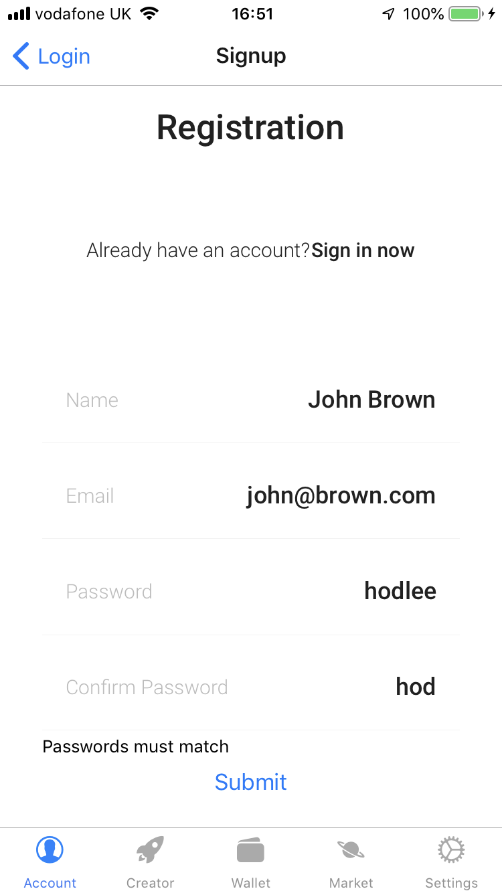
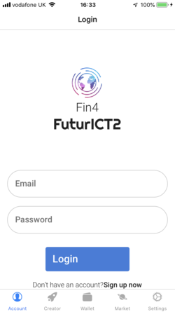
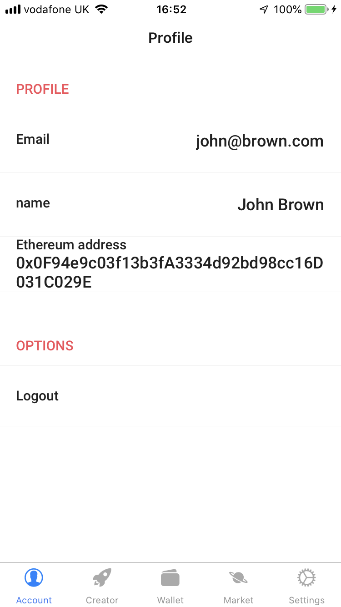
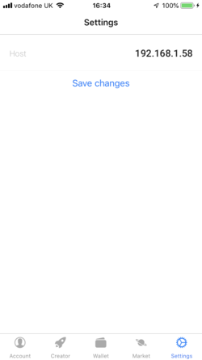

# Finance 4.0 Native Mobile App

This repository contains a front-end of the Finance 4.0 developed in React Native for Android and iOS devices.

## Set up
To run the application on your device, you can either use the prebuilt version, or build it locally. Both need [Expo](https://expo.io/) installed on the device. APK's may be released in the future.

#### Prebuilt instructions
Follow [this link](https://expo.io/@gabh/TokenCreator) to download the app from the device.

#### Locally built
```
git clone https://github.com/higab85/tokencreator
cd tokencreator
npm install
expo start
```

### Server
There is a test server running Fin4-core at www.finfour.net.

If you would like to create your own server, please follow the documentationon [the fin4-core github page](https://github.com/FuturICT2/fin4-core).

## How to use the app

#### Account Tab
On first opening the app, the user will be greeted with the a navigation bar with 5 tabs open on the Account tab. From here, the Login view, the user will be able to either log into the server, or click the sign up button to register on the server, on th sign up view. Once logged in, the Account tab will show information on the user's profile, on the profile view. 

Any errors will be relayed on a prompt.

   

#### Creator View
Next to the Login View we have the Creator view where the user can create tokens on the Fin4 server. The user will be able to choose:
- Token name
- Token symbol
- Decimals
- Purpose
- Burnability
- Transferability
- Mintability
- Whether it is capped (and if so, the cap)

All fields must be filled in, except for the cap if the token is uncapped. The token symbol must be 3 letters, the decimals field only accepts integers between 0 and 255, and the cap accepts any integer greater or equal to 1.

| Field           | Type    | Input validation        |
|-----------------|---------|-------------------------|
| Name            | String  | None                    |
| Symbol          | String  | 3 Characters            |
| Decimals        | Integer | 0<x<255                 |
| Purpose         | String  | None                    |
| Burnability     | Boolean | None                    |
| Transferability | Boolean | None                    |
| Mintability     | Boolean | None                    |
| Capped          | Boolean | None                    |
| Cap             | Integer | if Capped is true: x>0  |

Once the user taps submit, A prompt will appear confirming the user wants to create the token. The user will be able to carry out the action by tapping OK, or abort the action by tapping cancel.

  

#### Wallet view
This view shows the tokens held by the user, and the balance. This view can be refreshed by pulling down the screen.


#### Market view
This view shows the tokens available on the Fin4 server. This view can be refeshed by pulling down the screen.


#### Settings view
The user can specify the URL or IP of the Fin4 server on this view.




